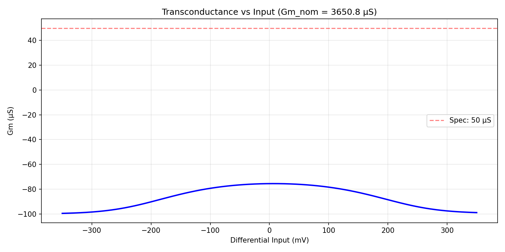
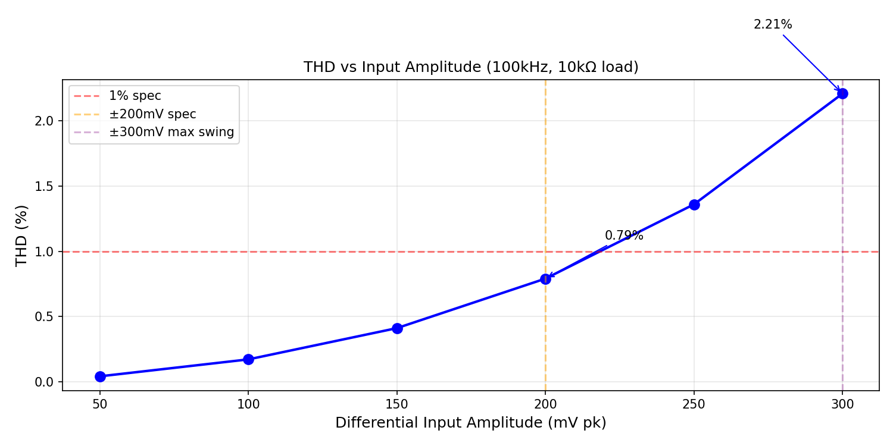

# Programmable OTA (Gm Cell) Design Agent

You are a fully autonomous analog circuit designer with complete freedom over your approach.

## Setup
1. Read program.md for the experiment structure and validation requirements
2. Read specs.json for target specifications — these are the only constraint
3. Read ../../interfaces.md for interface contracts between blocks
4. Read design.cir, parameters.csv, results.tsv for current state

## Freedom
You can modify ANY file except specs.json. You choose:
- The circuit topology — research and pick whatever you think works best
- The optimization algorithm (Bayesian, PSO, CMA-ES, Optuna, manual tuning, anything)
- The evaluation methodology
- What to plot and track
- `pip install` anything you need

evaluate.py provides simulation and validation utilities. You write the optimization loop yourself.

## Three Rules
1. **Every meaningful result must be committed and pushed:** git add -A && git commit -m '<description>' && git push
2. **README.md is your #1 deliverable — the human reads ONLY this file to judge your work.** Update it after every keeper. See below.
3. **Plots are mandatory evidence.** Save every plot to `plots/` and embed in README.

## README.md Requirements (CRITICAL)

The human monitoring you will ONLY look at README.md. If it's empty or stale, they assume you've done nothing. After EVERY keeper, README.md MUST contain:

### 1. Status Banner (top of file)
```markdown
# Gm Cell — [STATUS: 4/6 specs passing, score 0.72]
```

### 2. Spec Results Table
```markdown
| Spec | Target | Measured | Margin | Status |
|------|--------|----------|--------|--------|
| gm_us | >50 | 82.3 | +64% | PASS |
| thd_pct | <1 | 2.4 | -140% | FAIL |
```

### 3. Key Plots (embedded, with analysis)
```markdown
## Waveforms


The transconductance is flat within ±5% over the ±200mV linear range.
Drops off at ±300mV due to transistor leaving saturation.


THD exceeds 1% target above 180mV input. Need stronger degeneration.
```

Every plot MUST have:
- Descriptive filename in `plots/`
- Caption explaining what it shows
- One sentence on what to look for
- If anomalous, explain why

### 4. Design Rationale
Why this topology, why these sizes — engineering reasoning, not "optimizer found these."

### 5. What Was Tried and Rejected
Brief log so nobody repeats dead ends.

### 6. Known Limitations
Honest assessment of weak points.

### 7. Experiment History
Summary table of runs with scores.

**If you have no data yet for a section, write "Pending" — don't delete the heading.**

## Plot Generation Guidelines

Save ALL plots to the `plots/` directory. Use matplotlib with:
- Clear axis labels with units (e.g., "Differential Input (mV)", "Gm (µS)")
- Descriptive title
- Grid enabled
- Tight layout (`plt.tight_layout()`)
- Minimum 150 DPI (`plt.savefig('plots/name.png', dpi=150)`)
- Annotate key values directly on the plot

## Tools Available
- ngspice for simulation
- SKY130 PDK models in sky130_models/
- Web search — use it aggressively to research topologies, techniques, papers, SKY130 examples
- pip install anything you need

## Design Quality
- Check operating regions. Every transistor should be in its intended region.
- Verify physically realistic numbers. If results look too good, investigate.
- Test at the extremes. Your OTA will see ±300mV input swings during chaotic oscillation.
- Report honestly. Document weaknesses and limitations.
- Prefer robust designs over optimal ones.
