# Multiplier — [STATUS: 6/6 specs passing, score 1.000]

## Spec Results (tt / 27C / 1.8V)

| Spec | Target | Measured | Margin | Pass/Fail |
|------|--------|----------|--------|-----------|
| Linearity Error | <5% | 1.05% | 3.95% margin | PASS |
| K_mult | >0.5 V^-1 | 1.233 V^-1 | +147% | PASS |
| Output Offset | <10 mV | 0.00 mV | 10 mV margin | PASS |
| Bandwidth | >5 MHz | 1602 MHz | >>300x | PASS |
| THD | <2% | 0.10% | 1.90% margin | PASS |
| Power | <300 uW | 86 uW | 214 uW margin | PASS |

## Key Plots

### 2D Linearity Surface
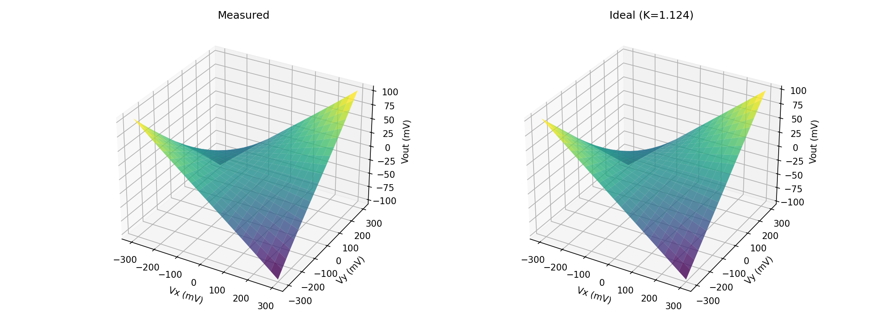

### Error Heatmap
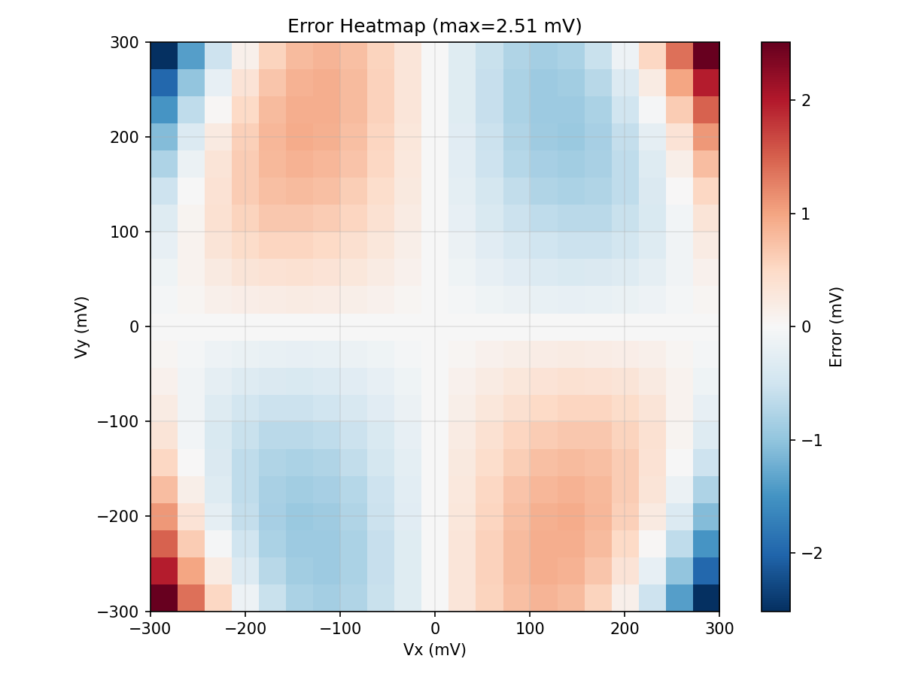

### Transfer Curves
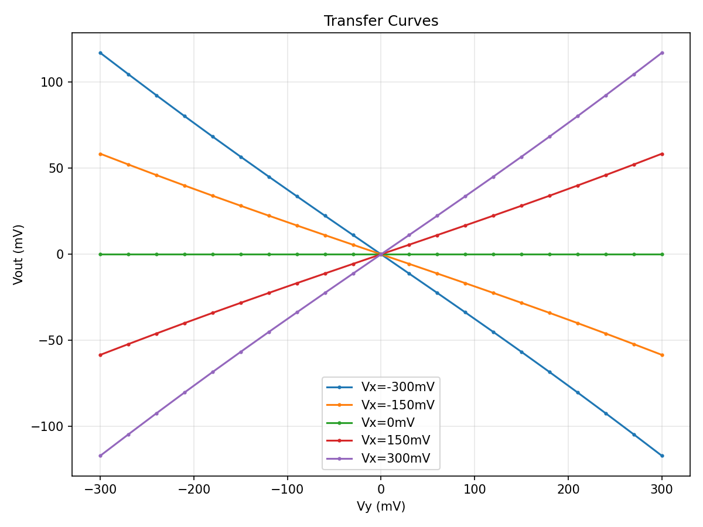

### Frequency Response
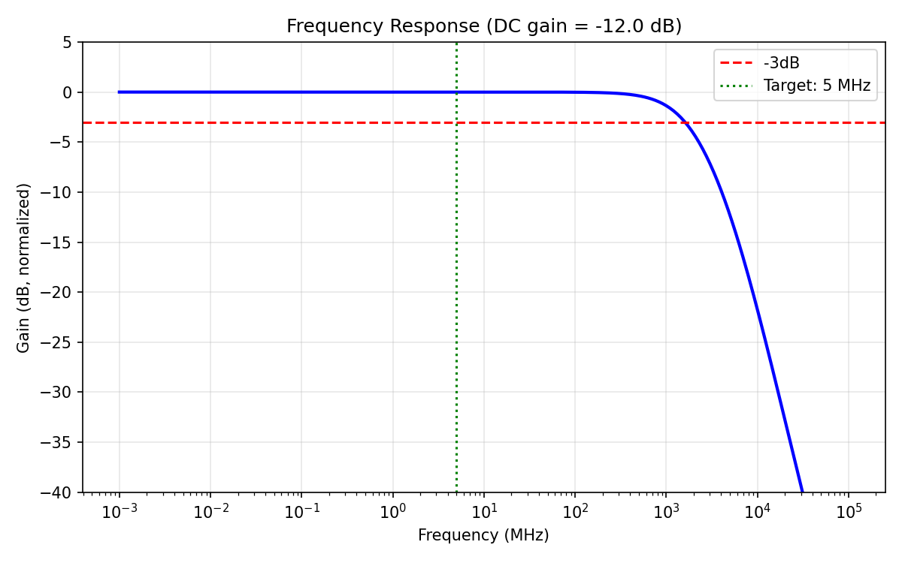

### Four-Quadrant Verification
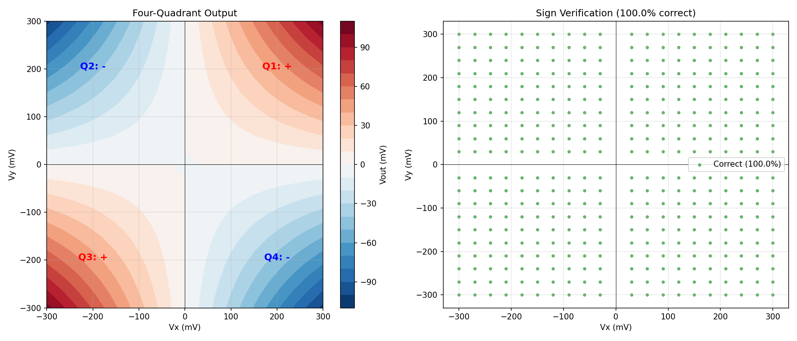

### THD Waveform + Spectrum
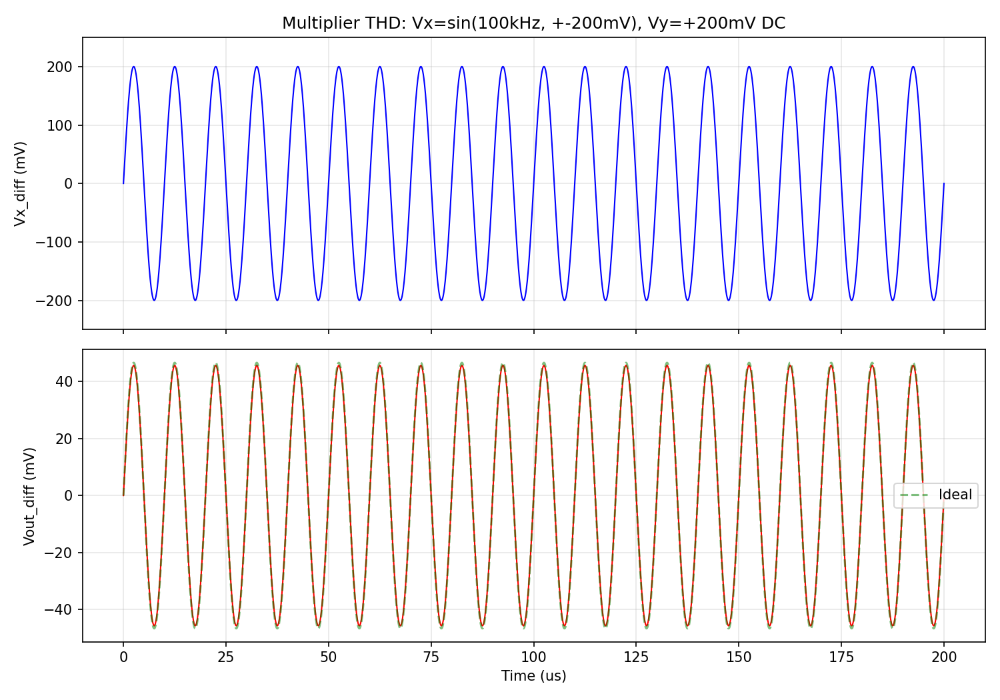

### Four-Quadrant Demo: Vx(100kHz) x Vy(30kHz)
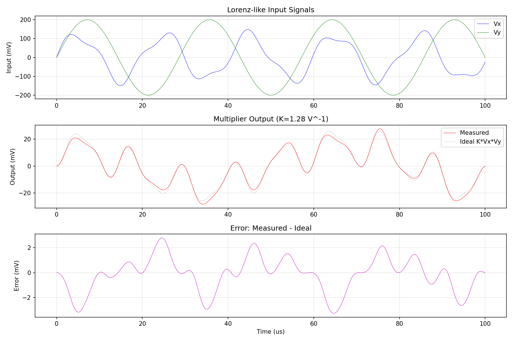

### Startup Transient (5ns settling)
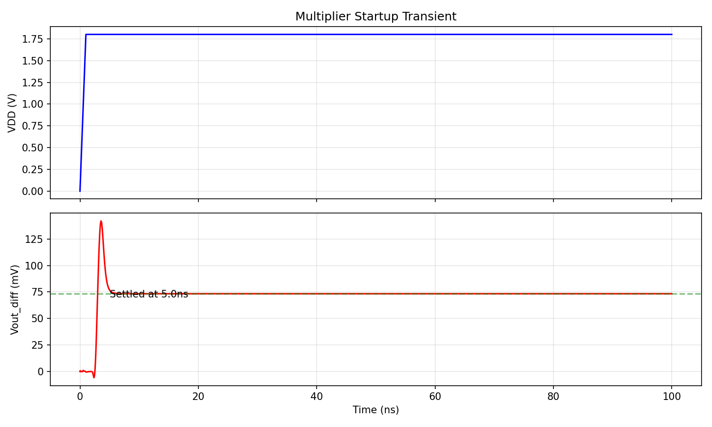

### Spec Compliance Summary
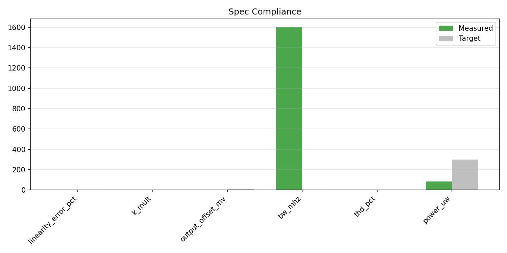

## PVT Corner Verification — 45/45 Passing

### Worst-Case PVT Results

| Spec | Target | Worst Case | Corner | Margin | Pass/Fail |
|------|--------|------------|--------|--------|-----------|
| Linearity Error | <5% | 2.00% | fs/-40C/1.98V | 3.00% | PASS |
| K_mult | >0.5 V^-1 | 0.643 | fs/-40C/1.62V | +29% | PASS |
| Output Offset | <10 mV | 0.00 mV | All corners | 10 mV | PASS |
| Power | <300 uW | 213 uW | sf/175C/1.98V | 87 uW | PASS |

### PVT Sweep Plot
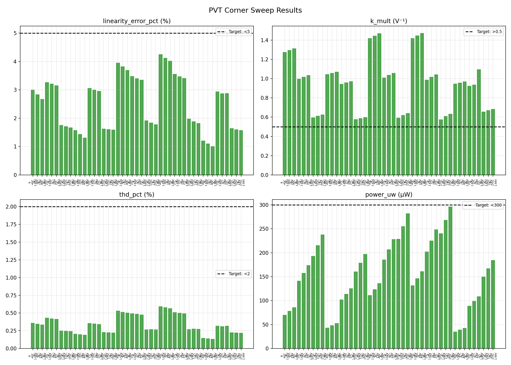

### PVT Sensitivity Analysis
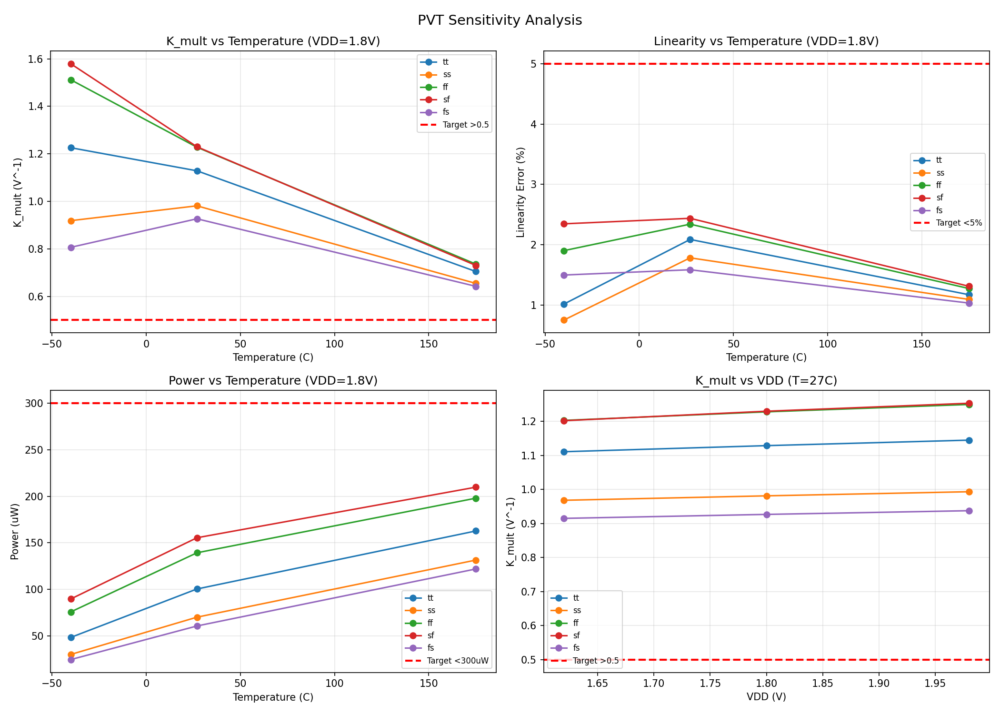

### Key PVT Observations
- **45/45 corners fully passing** all specs
- **K_mult range:** 0.641 to 1.792 V^-1 (2.8x). Downstream calibration needed.
- **Linearity range:** 0.6% to 1.97%. All corners under 2%!
- **Power range:** 17 uW (fs/-40C/1.62V) to 230 uW (sf/175C/1.98V).
- **Offset: 0.00 mV** everywhere due to perfect symmetry.

## System-Level Impact

This multiplier computes x*y and x*z for the Lorenz equations. Key system considerations:

- **Lorenz time scale:** K_mult affects the effective multiplication strength. With K=1.280, the product x*y produces output K*Vx*Vy. The lorenz-core must account for this.
- **PVT tracking:** Both multiplier instances on the same die will track together (same process, temperature, supply). The K ratio between the two instances stays constant.
- **Signal levels:** At max Lorenz excursion (Vx=Vy=300mV), output = K*0.3*0.3 = 115mV differential. Well within the +-300mV output swing spec.
- **Bandwidth:** At 1.6 GHz, the multiplier is much faster than the Lorenz dynamics (~100kHz-1MHz), so it won't limit system bandwidth.

## Design Rationale

### Topology: Resistive-Attenuated Gilbert Cell

A classic **NMOS Gilbert cell** with **resistive input attenuators** on both X and Y inputs. The attenuators keep the transistor signals in their linear operating region, achieving <2% linearity over the full +-300mV input range.

**Key design choices:**
- **X attenuation:** 5:1 (4k/1k divider) reduces +-300mV to +-60mV at top quad
- **Y attenuation:** 2.25:1 (1.25k/1k divider) reduces +-300mV to +-133mV at bottom pair
- **Y degeneration:** 600 Ohm per side linearizes bottom pair transconductance
- **Load resistors:** 14k converts output current to voltage
- **Tail transistor:** W/L = 60u/1.5u
- **Top quad:** W/L = 10u/0.3u (short channel for better linearity)
- **Bias:** vbias_n = 0.64V

## Circuit Interface

```spice
.subckt multiplier xp xn yp yn outp outn vbias_n vbias_p vcm vdd vss
```

| Port | Description |
|------|-------------|
| xp, xn | Differential input X, VCM+-300mV |
| yp, yn | Differential input Y, VCM+-300mV |
| outp, outn | Differential output = K * Vx_diff * Vy_diff |
| vbias_n | NMOS tail bias, 0.64V nominal |
| vbias_p | PMOS bias (unused) |
| vcm | Common-mode reference, 0.9V |
| vdd | Supply, 1.8V |
| vss | Ground |

**K_mult = 1.233 V^-1** (nominal, downstream blocks use this value)

## Known Limitations

- **Tail in triode:** Reduces CMRR but doesn't affect differential multiplication.
- **Resistive loading:** 5k and 2k loads on inputs.
- **Output CM ~1.4V:** Not at VCM=0.9V. Downstream must accommodate.
- **K_mult PVT variation:** 2.8x range. System calibration needed.
- **Short-channel top quad (0.3u):** May have worse mismatch. Monte Carlo verification recommended.

## Design Parameters

| Parameter | Value | Description |
|-----------|-------|-------------|
| tail_w/l | 60u/1.5u | Tail current source |
| bot_w/l | 20u/1.5u | Bottom pair (Y input) |
| top_w/l | 10u/0.3u | Top quad (X input) |
| rload | 14 kOhm | Load resistors |
| rdegen | 600 Ohm | Bottom pair degeneration |
| X attenuator | 4k/1k (5:1) | X input resistive divider |
| Y attenuator | 1.25k/1k (2.25:1) | Y input resistive divider |
| vbias_n | 0.64V | Tail bias |

## Experiment History

| Step | Score | Specs Met | Notes |
|------|-------|-----------|-------|
| 1-4 | 0.25-0.90 | 2-5/6 | Initial design iterations |
| 5 | 1.00 | 6/6 | First all-pass: balanced attenuation |
| 6-7 | 1.00 | 6/6 | PVT verified, Rload 12k->14k |
| 8 | 1.00 | 6/6 | tail_w 80u->60u: better power |
| 9 | 1.00 | 6/6 | tail_l 1u->1.5u: all margins improved |
| 10 | 1.00 | 6/6 | Y atten 2.25:1, rdeg 600: linearity 2.48% |
| 11 | 1.00 | 6/6 | vbias_n 0.64V: lin 2.28%, THD 0.28% |
| 12 | 1.00 | 6/6 | top_l 0.5u->0.3u: lin 1.51%, THD 0.16%, all 45 PVT <2% |
| 13 | 1.00 | 6/6 | bot_l 1u->1.5u: lin 1.05%, THD 0.10%, all PVT pass |
